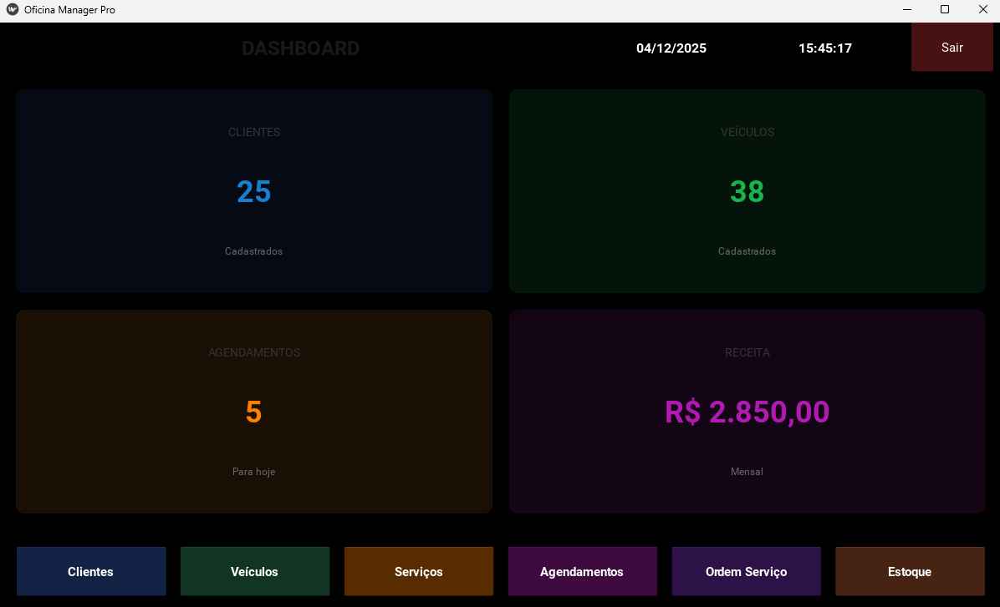
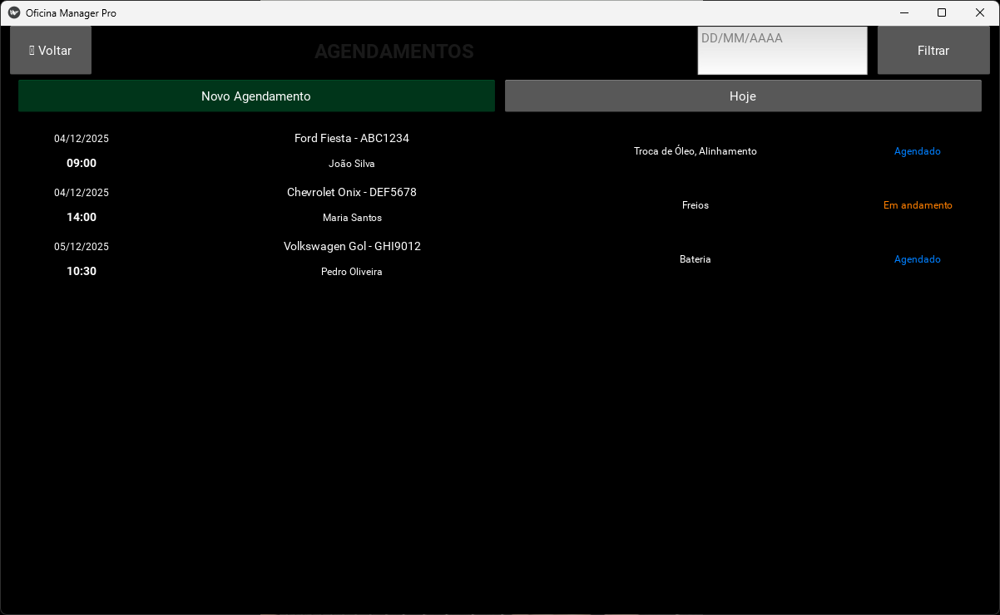
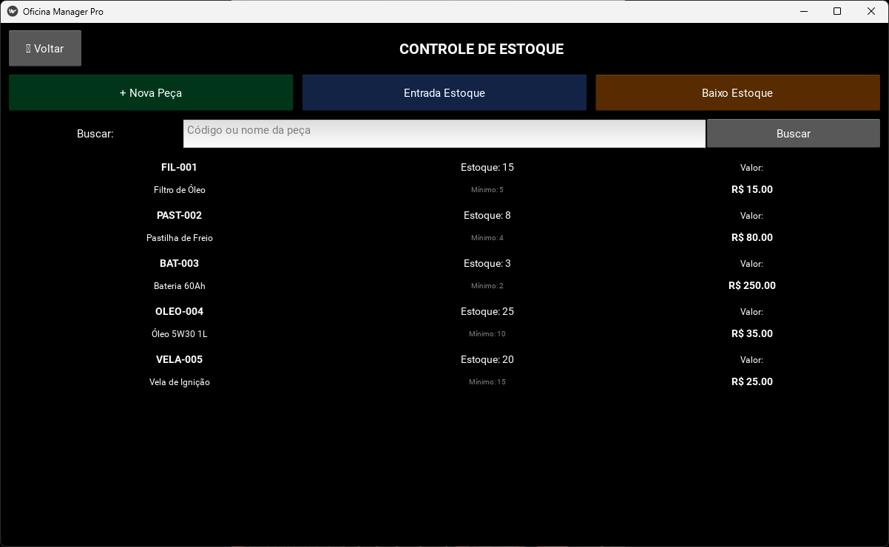
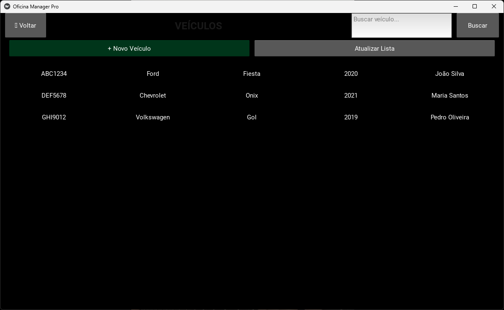
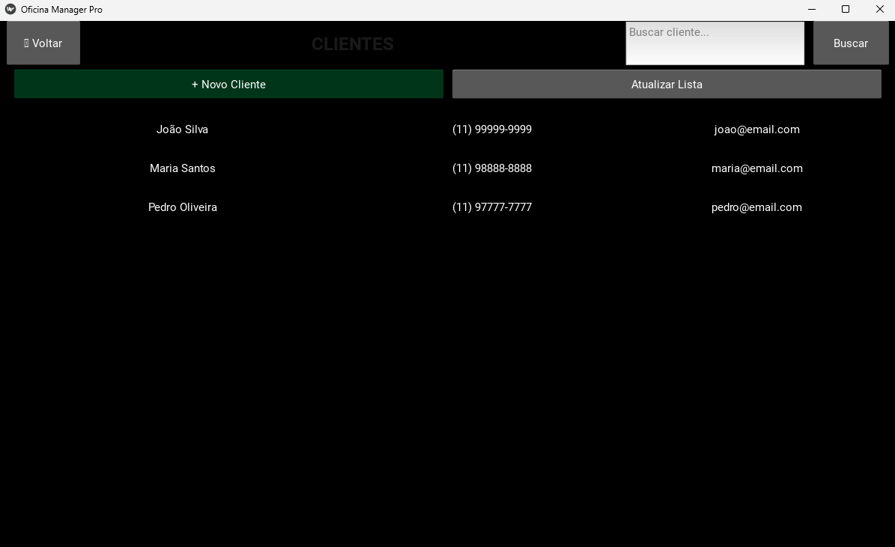
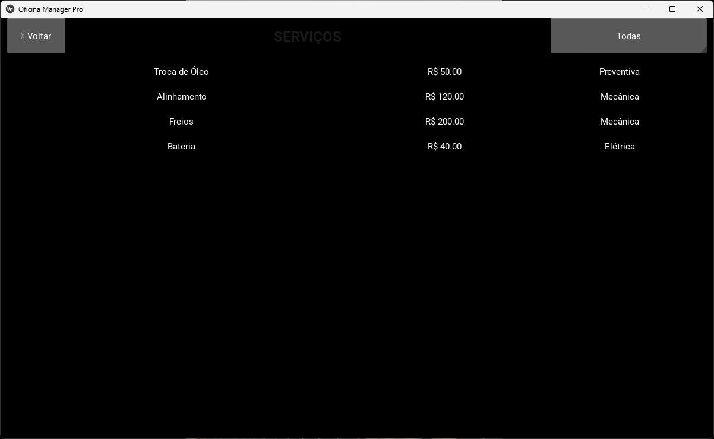
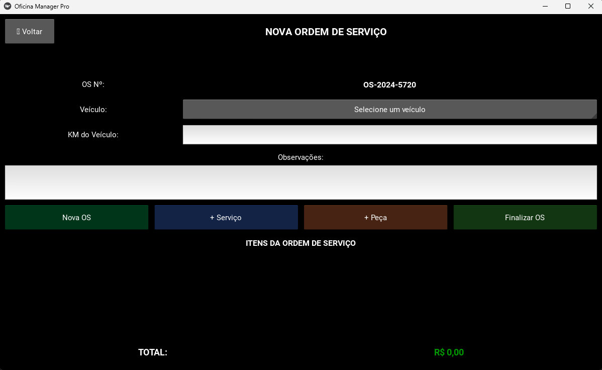

🚗 Oficina Manager Pro

Sistema desktop completo para gerenciamento de oficinas mecânicas, com foco em organização, produtividade e controle total das operações.

📋 Sobre o Projeto

O Oficina Manager Pro é uma aplicação desktop desenvolvida em Python com interface moderna em CustomTkinter (Dark Mode).
O objetivo é auxiliar oficinas mecânicas a substituírem planilhas e anotações por um sistema simples, intuitivo e eficiente.

✨ Funcionalidades
🧭 Dashboard Interativo

Total de clientes, veículos e agendamentos

Receita estimada do mês

Acesso rápido para todos os módulos

👥 Gestão de Clientes

Cadastro completo

Busca rápida

Relacionamento com veículos

🚘 Gestão de Veículos

Placa, marca, modelo e ano

Veículos vinculados ao cliente

📅 Agendamentos

Visualização por data

Status: Agendado, Em andamento, Concluído

Listagem e filtros

🔧 Catálogo de Serviços

Preços padronizados

Tabela detalhada de serviços

📦 Controle de Estoque

Quantidade mínima

Alertas de estoque baixo

Entrada e saída de itens

📝 Ordem de Serviço (OS)

Seleção de cliente / veículo

Adição de serviços e peças

Cálculo automático do valor final

📷 Screenshots
-Dashboard

-Agendamentos

-Estoque

-Veículos

-Clientes

-Serviços

-Nova OS

🛠️ Tecnologias Utilizadas

Python 3.x

CustomTkinter (Interface moderna)

SQLite (Banco de dados local)

Pillow (Manipulação de imagens)

🚀 Como Executar o Projeto

✔️ 1. Clonar o repositório
git clone https://github.com/RegisnaldoJunior/oficina_aap.git

✔️ 2. Acessar a pasta do projeto
cd oficina_aap

✔️ 3. Instalar dependências

(Use ambiente virtual se desejar)

pip install -r requirements.txt

Se não houver o arquivo:

pip install customtkinter pillow

✔️ 4. Executar a aplicação
python main.py

📄 Licença

Este projeto está licenciado sob a MIT License.
Consulte o arquivo LICENSE para mais informações.

🤝 Contribuições

Contribuições são sempre bem-vindas!
Fique à vontade para abrir issues, enviar sugestões ou criar pull requests.

👤 Autor

Regisnaldo Junior
Se quiser trocar uma ideia ou sugerir melhorias, estou à disposição!

